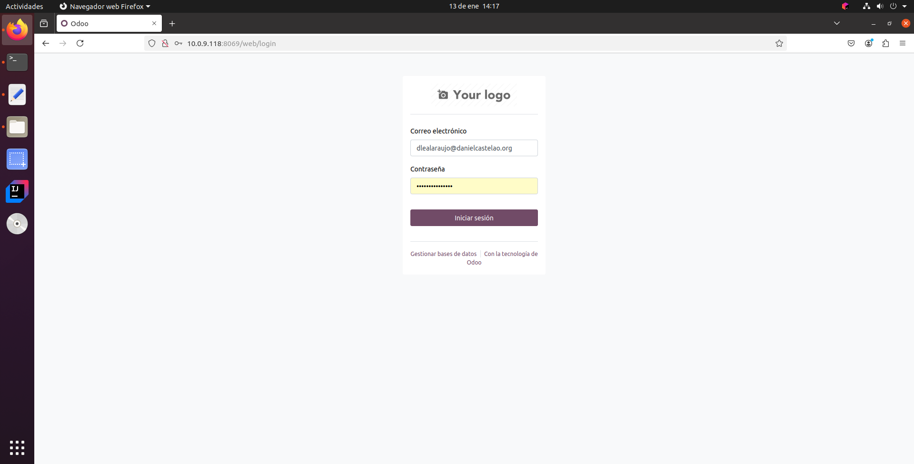
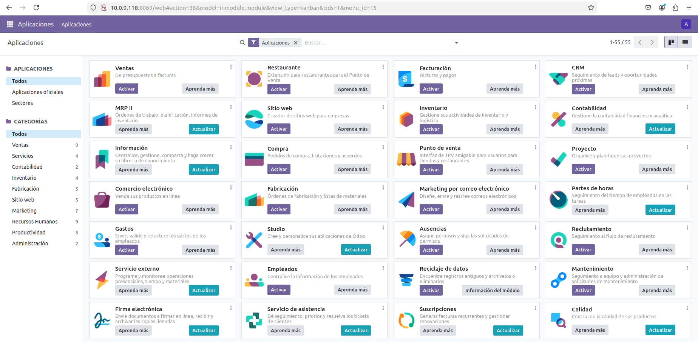
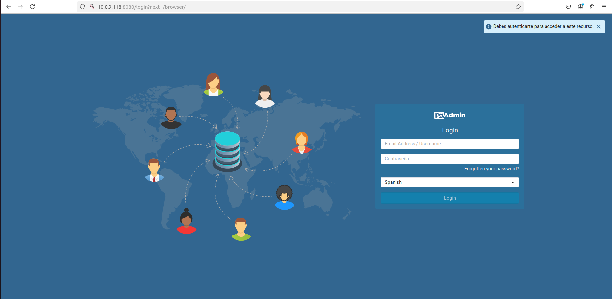
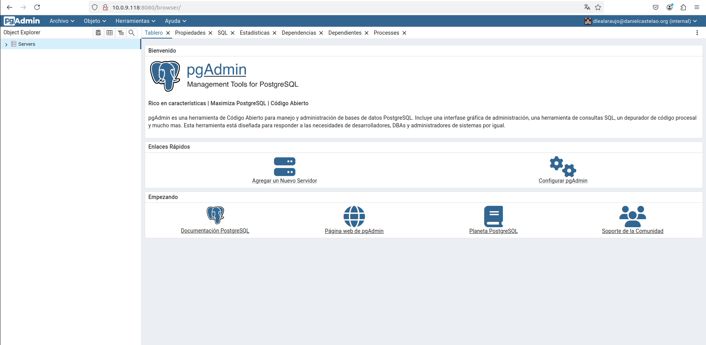
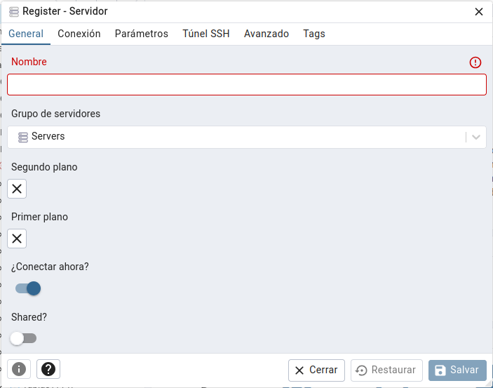
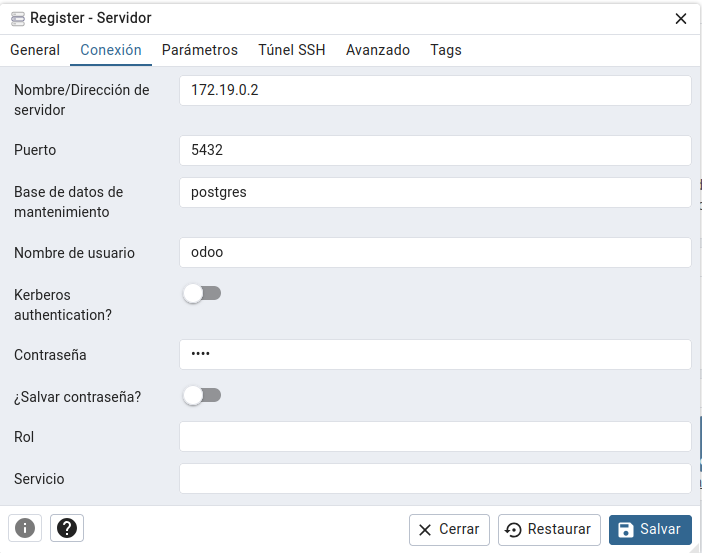
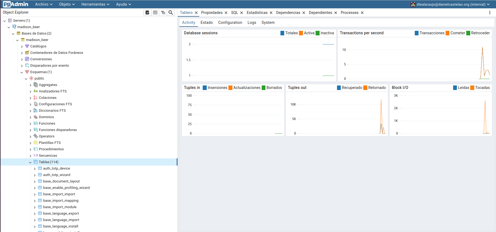

# Tarea_10_SXE

## 1. Instalar Odoo 17 Community junto a PostgreSQL con Docker Compose

Para instalar Odoo mediante Docker Compose se precisa de la siguiente imagen:
```bash
  odoo:
    image: odoo:17
    restart: always
    ports:
      - "8069:8069"
    depends_on:
      - db
    environment:
      - USER=odoo
      - PASSWORD=odoo
    volumes:
      - ./config:/etc/odoo
      - ./extra-addons:/mnt/extra-addons
  db:
    image: postgres:latest
    restart: always
    environment:
      - POSTGRES_USER=odoo
      - POSTGRES_PASSWORD=odoo
      - POSTGRES_DB=postgres
      - PGDATA=/var/lib/postgresql/data/pgdata
  ```
Iniciar el docker compose:
```bash
sudo docker compose up -d
```
Haces el siguiente comando para saber tu ip (en mi caso esta 10.0.9.117):
```
ip a
```
 <details>
     <summary>Salida:</summary>
   
                  1: lo: <LOOPBACK,UP,LOWER_UP> mtu 65536 qdisc noqueue state UNKNOWN group default qlen 1000
                      link/loopback 00:00:00:00:00:00 brd 00:00:00:00:00:00
                        inet 127.0.0.1/8 scope host lo
                         valid_lft forever preferred_lft forever
                          inet6 ::1/128 scope host 
                         valid_lft forever preferred_lft forever
                  2: enp0s3: <BROADCAST,MULTICAST,UP,LOWER_UP> mtu 1500 qdisc fq_codel state UP group default qlen 1000
                    link/ether 08:00:27:f7:4c:26 brd ff:ff:ff:ff:ff:ff
                    inet 10.0.9.117/24 brd 10.0.9.255 scope global dynamic noprefixroute enp0s3
                       valid_lft 82382sec preferred_lft 82382sec
                    inet6 fe80::1dc6:8ee4:e29c:80e8/64 scope link dadfailed tentative noprefixroute 
                       valid_lft forever preferred_lft forever
                    inet6 fe80::6e28:6de9:d49b:a7f3/64 scope link noprefixroute 
                       valid_lft forever preferred_lft forever
                3: br-c63a9802aae3: <NO-CARRIER,BROADCAST,MULTICAST,UP> mtu 1500 qdisc noqueue state DOWN group default 
                    link/ether 02:42:9f:7b:39:6f brd ff:ff:ff:ff:ff:ff
                    inet 172.18.0.1/16 brd 172.18.255.255 scope global br-c63a9802aae3
                       valid_lft forever preferred_lft forever
                4: docker0: <NO-CARRIER,BROADCAST,MULTICAST,UP> mtu 1500 qdisc noqueue state DOWN group default 
                    link/ether 02:42:43:82:0b:cf brd ff:ff:ff:ff:ff:ff
                    inet 172.17.0.1/16 brd 172.17.255.255 scope global docker0
                       valid_lft forever preferred_lft forever
                5: br-809080e22097: <BROADCAST,MULTICAST,UP,LOWER_UP> mtu 1500 qdisc noqueue state UP group default 
                    link/ether 02:42:53:25:63:57 brd ff:ff:ff:ff:ff:ff
                    inet 172.19.0.1/16 brd 172.19.255.255 scope global br-809080e22097
                       valid_lft forever preferred_lft forever
                    inet6 fe80::42:53ff:fe25:6357/64 scope link 
                       valid_lft forever preferred_lft forever
                13: veth53fd111@if12: <BROADCAST,MULTICAST,UP,LOWER_UP> mtu 1500 qdisc noqueue master br-809080e22097 state UP group default 
                    link/ether f6:80:0c:a1:12:a9 brd ff:ff:ff:ff:ff:ff link-netnsid 0
                    inet6 fe80::f480:cff:fea1:12a9/64 scope link 
                       valid_lft forever preferred_lft forever
                15: veth8015b43@if14: <BROADCAST,MULTICAST,UP,LOWER_UP> mtu 1500 qdisc noqueue master br-809080e22097 state UP group default 
                    link/ether de:5e:73:cf:9a:04 brd ff:ff:ff:ff:ff:ff link-netnsid 1
                    inet6 fe80::dc5e:73ff:fecf:9a04/64 scope link 
                       valid_lft forever preferred_lft forever
                17: vethdff67be@if16: <BROADCAST,MULTICAST,UP,LOWER_UP> mtu 1500 qdisc noqueue master br-809080e22097 state UP group default 
                    link/ether 3a:9d:ff:c9:5f:80 brd ff:ff:ff:ff:ff:ff link-netnsid 2
                    inet6 fe80::389d:ffff:fec9:5f80/64 scope link 
                       valid_lft forever preferred_lft forever
</details>
Vas a tu navegador y pones lo siguientes:
```bash
10.0.9.117:8069
```
Salida:

Rellenas con tu información y le das a create database (Si te da algún error puede ser que la contraseña maestra es poco segura, recomienda usar la que te pone al iniciar.).


Te deberia aparecer esta pestaña:

Inicias sesion con los datos anteriores.


Y ya tendrias acceso a Odoo:


## 2. Instalar PgAdmin y conectarlo con la Base de Datos

Añades esto al Docker Compose:
```bash
pgadmin:
    image: dpage/pgadmin4
    restart: always
    ports:
      - "8080:80"
    environment:
      PGADMIN_DEFAULT_EMAIL: dlealaraujo@danielcastelao.org
      PGADMIN_DEFAULT_PASSWORD: admin
    depends_on:
      - db
```
Entras en la siguiente dirección(recuerda que yo estoy poniendo mi ip):
```bash
10.0.9.117:8080
```
Salida:





Te registras con la información puesta en el docker compose.


Te debería salir esto:





Vas a la pestaña de donde pone servers le das clic derecho, seleccionas register y servidor.





Le pones el nombre que quieras y te vas a la pestaña de conexión.





Aquí tienes que poner el puerto 5432 y para conseguir la ip tienes que seguir los siguientes pasos:
  - Ver el nombre del contenedor de postgres con el siguiente comando:
    ```bash
    sudo docker ps -a
    ```
    Salida:
    ```bash
    CONTAINER ID   IMAGE             COMMAND                  CREATED        STATUS             PORTS                                                      NAMES
    39a2c8555157   dpage/pgadmin4    "/entrypoint.sh"         45 hours ago   Up About an hour   443/tcp,        0.0.0.0:8080->80/tcp, [::]:8080->80/tcp           odoo-pgadmin-1
    fcfa8be70391   odoo:17           "/entrypoint.sh odoo"    45 hours ago   Up About an hour                   0.0.0.0:8069->8069/tcp, :::8069->8069/tcp, 8071-8072/tcp   odoo-odoo-1
    **273e8a723097   postgres:latest   "docker-entrypoint.s…"   45 hours ago   Up About an hour   5432/tcp       **
    ```
  - Ver la ip del contenedor con el siguiente comando:
     ```bash
     sudo docker inspect 273e8a723097
     ```
     <details>
     <summary>Salida:</summary>

           [
        {
        "Id": "273e8a723097198a9bfc438811212335b16b86053bb10ac7cc2fc34d1ff06497",
        "Created": "2025-01-13T13:15:20.456421136Z",
        "Path": "docker-entrypoint.sh",
        "Args": [
            "postgres"
        ],
        "State": {
            "Status": "running",
            "Running": true,
            "Paused": false,
            "Restarting": false,
            "OOMKilled": false,
            "Dead": false,
            "Pid": 5433,
            "ExitCode": 0,
            "Error": "",
            "StartedAt": "2025-01-15T09:13:16.983901205Z",
            "FinishedAt": "2025-01-15T09:13:14.009605028Z"
        },
        "Image": "sha256:4bc6cc20ca7a7d56c3cefa8dd618dd6a5419827cef9a1133c49f3156b9436471",
        "ResolvConfPath": "/var/lib/docker/containers/273e8a723097198a9bfc438811212335b16b86053bb10ac7cc2fc34d1ff06497/resolv.conf",
        "HostnamePath": "/var/lib/docker/containers/273e8a723097198a9bfc438811212335b16b86053bb10ac7cc2fc34d1ff06497/hostname",
        "HostsPath": "/var/lib/docker/containers/273e8a723097198a9bfc438811212335b16b86053bb10ac7cc2fc34d1ff06497/hosts",
        "LogPath": "/var/lib/docker/containers/273e8a723097198a9bfc438811212335b16b86053bb10ac7cc2fc34d1ff06497/273e8a723097198a9bfc438811212335b16b86053bb10ac7cc2fc34d1ff06497-json.log",
        "Name": "/odoo-db-1",
        "RestartCount": 0,
        "Driver": "overlay2",
        "Platform": "linux",
        "MountLabel": "",
        "ProcessLabel": "",
        "AppArmorProfile": "docker-default",
        "ExecIDs": null,
        "HostConfig": {
            "Binds": null,
            "ContainerIDFile": "",
            "LogConfig": {
                "Type": "json-file",
                "Config": {}
            },
            "NetworkMode": "odoo_default",
            "PortBindings": {},
            "RestartPolicy": {
                "Name": "always",
                "MaximumRetryCount": 0
            },
            "AutoRemove": false,
            "VolumeDriver": "",
            "VolumesFrom": null,
            "ConsoleSize": [
                0,
                0
            ],
            "CapAdd": null,
            "CapDrop": null,
            "CgroupnsMode": "host",
            "Dns": [],
            "DnsOptions": [],
            "DnsSearch": [],
            "ExtraHosts": [],
            "GroupAdd": null,
            "IpcMode": "private",
            "Cgroup": "",
            "Links": null,
            "OomScoreAdj": 0,
            "PidMode": "",
            "Privileged": false,
            "PublishAllPorts": false,
            "ReadonlyRootfs": false,
            "SecurityOpt": null,
            "UTSMode": "",
            "UsernsMode": "",
            "ShmSize": 67108864,
            "Runtime": "runc",
            "Isolation": "",
            "CpuShares": 0,
            "Memory": 0,
            "NanoCpus": 0,
            "CgroupParent": "",
            "BlkioWeight": 0,
            "BlkioWeightDevice": null,
            "BlkioDeviceReadBps": null,
            "BlkioDeviceWriteBps": null,
            "BlkioDeviceReadIOps": null,
            "BlkioDeviceWriteIOps": null,
            "CpuPeriod": 0,
            "CpuQuota": 0,
            "CpuRealtimePeriod": 0,
            "CpuRealtimeRuntime": 0,
            "CpusetCpus": "",
            "CpusetMems": "",
            "Devices": null,
            "DeviceCgroupRules": null,
            "DeviceRequests": null,
            "MemoryReservation": 0,
            "MemorySwap": 0,
            "MemorySwappiness": null,
            "OomKillDisable": false,
            "PidsLimit": null,
            "Ulimits": null,
            "CpuCount": 0,
            "CpuPercent": 0,
            "IOMaximumIOps": 0,
            "IOMaximumBandwidth": 0,
            "MaskedPaths": [
                "/proc/asound",
                "/proc/acpi",
                "/proc/kcore",
                "/proc/keys",
                "/proc/latency_stats",
                "/proc/timer_list",
                "/proc/timer_stats",
                "/proc/sched_debug",
                "/proc/scsi",
                "/sys/firmware",
                "/sys/devices/virtual/powercap"
            ],
            "ReadonlyPaths": [
                "/proc/bus",
                "/proc/fs",
                "/proc/irq",
                "/proc/sys",
                "/proc/sysrq-trigger"
            ]
        },
        "GraphDriver": {
            "Data": {
                "LowerDir": "/var/lib/docker/overlay2/f7b84619f4dc045872a8e1c3a571f39b880a818287ef71ed46a11db2fe08fa32-init/diff:/var/lib/docker/overlay2/5e77199c23f9e2b3358aa66b5965674f182a4e771e22b4a58a53034067d947e1/diff:/var/lib/docker/overlay2/a4882fe27fb23c76189b2b6dd02d62d501fdca32e88c5e479a09691113d3b252/diff:/var/lib/docker/overlay2/1d527778548792553a5b8731fa8236fc03b4f2518dc94009070b368333aa3390/diff:/var/lib/docker/overlay2/66dbd4e710cd64d36d669f34114901e2e28bd5b770550516a1e32876d5da9e6b/diff:/var/lib/docker/overlay2/001a6bb60b81e5f624ecba8ed34dbbcb1431a670e8e67f38b092c7398a71fe7d/diff:/var/lib/docker/overlay2/3c163d65d09e085ccda62ee8ac991e57dc2de62a05a33735a272273f105317c3/diff:/var/lib/docker/overlay2/d595a637f02260851ba84459e3f8ac9312f22014a2fd4c9e40b4804ea93960d9/diff:/var/lib/docker/overlay2/e5e9e6c015b4cb91368b79535a9aabcf4cd7bf1dc2a5a878c6221078d201d745/diff:/var/lib/docker/overlay2/c68d963f210295ceebf0517920b8274f185fc2f691fb5a0e7def84bc446d9464/diff:/var/lib/docker/overlay2/23602d39f2df725880287fda560c3e60d339ba9504074384381779a354503010/diff:/var/lib/docker/overlay2/68d13e111f910a4cf5600c2f0e1e985c82f743328ceab08e85187ce0dc16d3c0/diff:/var/lib/docker/overlay2/5494beb6c3ce5992ab6483b51ea1fa573a001427750d510b8e069b82004ccbce/diff:/var/lib/docker/overlay2/981f38c466f610c6826dde31a0dd765bda0ed123678611faa2fa1721f8e9fb64/diff:/var/lib/docker/overlay2/a8fe29f88359045152b2394fa79414581aa0263de21660a4ff87057043761b2d/diff",
                "MergedDir": "/var/lib/docker/overlay2/f7b84619f4dc045872a8e1c3a571f39b880a818287ef71ed46a11db2fe08fa32/merged",
                "UpperDir": "/var/lib/docker/overlay2/f7b84619f4dc045872a8e1c3a571f39b880a818287ef71ed46a11db2fe08fa32/diff",
                "WorkDir": "/var/lib/docker/overlay2/f7b84619f4dc045872a8e1c3a571f39b880a818287ef71ed46a11db2fe08fa32/work"
            },
            "Name": "overlay2"
        },
        "Mounts": [
            {
                "Type": "volume",
                "Name": "83397f9097c677c80e8ad2e926eaa498bcd81430cb00408e6d0d50bf91b290f1",
                "Source": "/var/lib/docker/volumes/83397f9097c677c80e8ad2e926eaa498bcd81430cb00408e6d0d50bf91b290f1/_data",
                "Destination": "/var/lib/postgresql/data",
                "Driver": "local",
                "Mode": "",
                "RW": true,
                "Propagation": ""
            }
        ],
        "Config": {
            "Hostname": "273e8a723097",
            "Domainname": "",
            "User": "",
            "AttachStdin": false,
            "AttachStdout": true,
            "AttachStderr": true,
            "ExposedPorts": {
                "5432/tcp": {}
            },
            "Tty": false,
            "OpenStdin": false,
            "StdinOnce": false,
            "Env": [
                "POSTGRES_USER=odoo",
                "POSTGRES_PASSWORD=odoo",
                "POSTGRES_DB=postgres",
                "PGDATA=/var/lib/postgresql/data/pgdata",
                "PATH=/usr/local/sbin:/usr/local/bin:/usr/sbin:/usr/bin:/sbin:/bin:/usr/lib/postgresql/17/bin",
                "GOSU_VERSION=1.17",
                "LANG=en_US.utf8",
                "PG_MAJOR=17",
                "PG_VERSION=17.2-1.pgdg120+1"
            ],
            "Cmd": [
                "postgres"
            ],
            "Image": "postgres:latest",
            "Volumes": {
                "/var/lib/postgresql/data": {}
            },
            "WorkingDir": "",
            "Entrypoint": [
                "docker-entrypoint.sh"
            ],
            "OnBuild": null,
            "Labels": {
                "com.docker.compose.config-hash": "391e615bd07ed4e028322947f24f50ea5287983dae8ffe7e1bf74a89646bbd32",
                "com.docker.compose.container-number": "1",
                "com.docker.compose.depends_on": "",
                "com.docker.compose.image": "sha256:4bc6cc20ca7a7d56c3cefa8dd618dd6a5419827cef9a1133c49f3156b9436471",
                "com.docker.compose.oneoff": "False",
                "com.docker.compose.project": "odoo",
                "com.docker.compose.project.config_files": "/home/accesodatos/odoo/docker-compose.yml",
                "com.docker.compose.project.working_dir": "/home/accesodatos/odoo",
                "com.docker.compose.service": "db",
                "com.docker.compose.version": "2.32.1"
            },
            "StopSignal": "SIGINT"
        },
        "NetworkSettings": {
            "Bridge": "",
            "SandboxID": "a8809edbb5d5a6393617e42f5657afce48eab74fdbdae970a5755a77937e45a0",
            "SandboxKey": "/var/run/docker/netns/a8809edbb5d5",
            "Ports": {
                "5432/tcp": null
            },
            "HairpinMode": false,
            "LinkLocalIPv6Address": "",
            "LinkLocalIPv6PrefixLen": 0,
            "SecondaryIPAddresses": null,
            "SecondaryIPv6Addresses": null,
            "EndpointID": "",
            "Gateway": "",
            "GlobalIPv6Address": "",
            "GlobalIPv6PrefixLen": 0,
            "IPAddress": "",
            "IPPrefixLen": 0,
            "IPv6Gateway": "",
            "MacAddress": "",
            "Networks": {
                "odoo_default": {
                    "IPAMConfig": null,
                    "Links": null,
                    "Aliases": [
                        "odoo-db-1",
                        "db"
                    ],
                    "MacAddress": "02:42:ac:13:00:02",
                    "DriverOpts": null,
                    "NetworkID": "809080e2209755a3c066738b5cf4d246ca8304310679c0691e6a0615cf93f818",
                    "EndpointID": "064c004987762750e2b6a84efae0eb9505eb0b0a41e9e31872f106aba1f162b9",
                    "Gateway": "172.19.0.1",
                    "IPAddress": "172.19.0.2",
                    "IPPrefixLen": 16,
                    "IPv6Gateway": "",
                    "GlobalIPv6Address": "",
                    "GlobalIPv6PrefixLen": 0,
                    "DNSNames": [
                        "odoo-db-1",
                        "db",
                        "273e8a723097"
                    ]
                  }
               }
            }
         }
        ]
</details>


Y de aquí sacas la IPAddress que en mi caso es 172.19.0.2, lo colocas en dirección de servidor y le das a salvar.





Y ya estaría instalado.


## Preguntas: ¿Qué ocurre si en el ordenador local el puerto 5432 está ocupado? ¿Y si lo estuviese el 8069? ¿Cómo puedes solucionarlo?

Si el puerto 5442 que es el de postgreSQL está ocupado ya por otro servicio no se podría acceder a la base de datos, la solución sería poner otro puerto en el docker compose.


Y lo mismo para el caso del 8069, pero en este caso es el puerto utilizado en odoo entonces lo que deberías de cambiar es el puerto de odoo en el docker compose.


    
     


