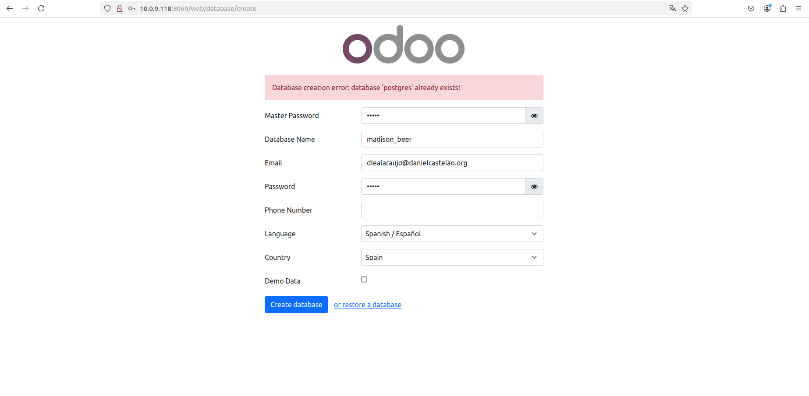

# Tarea_10_SXE

## 1. Instalar Odoo 17 Community junto a PostgreSQL con Docker Compose

Para instalar Odoo mediante Docker Compose se precisa de la siguiente imagen:
```bash
  odoo:
    image: odoo:17
    restart: always
    ports:
      - "8069:8069"
    depends_on:
      - db
    environment:
      - USER=odoo
      - PASSWORD=odoo
    volumes:
      - ./config:/etc/odoo
      - ./extra-addons:/mnt/extra-addons
  db:
    image: postgres:latest
    restart: always
    environment:
      - POSTGRES_USER=odoo
      - POSTGRES_PASSWORD=odoo
      - POSTGRES_DB=postgres
      - PGDATA=/var/lib/postgresql/data/pgdata
  ```
Iniciar el docker compose:
```bash
sudo docker compose up 
```
Haces el siguiente comando para saber tu ip (en mi caso esta 10.0.9.117):
```
ip a
```
Salida:
```bash
1: lo: <LOOPBACK,UP,LOWER_UP> mtu 65536 qdisc noqueue state UNKNOWN group default qlen 1000
    link/loopback 00:00:00:00:00:00 brd 00:00:00:00:00:00
    inet 127.0.0.1/8 scope host lo
       valid_lft forever preferred_lft forever
    inet6 ::1/128 scope host 
       valid_lft forever preferred_lft forever
2: enp0s3: <BROADCAST,MULTICAST,UP,LOWER_UP> mtu 1500 qdisc fq_codel state UP group default qlen 1000
    link/ether 08:00:27:f7:4c:26 brd ff:ff:ff:ff:ff:ff
    inet 10.0.9.117/24 brd 10.0.9.255 scope global dynamic noprefixroute enp0s3
       valid_lft 82382sec preferred_lft 82382sec
    inet6 fe80::1dc6:8ee4:e29c:80e8/64 scope link dadfailed tentative noprefixroute 
       valid_lft forever preferred_lft forever
    inet6 fe80::6e28:6de9:d49b:a7f3/64 scope link noprefixroute 
       valid_lft forever preferred_lft forever
3: br-c63a9802aae3: <NO-CARRIER,BROADCAST,MULTICAST,UP> mtu 1500 qdisc noqueue state DOWN group default 
    link/ether 02:42:9f:7b:39:6f brd ff:ff:ff:ff:ff:ff
    inet 172.18.0.1/16 brd 172.18.255.255 scope global br-c63a9802aae3
       valid_lft forever preferred_lft forever
4: docker0: <NO-CARRIER,BROADCAST,MULTICAST,UP> mtu 1500 qdisc noqueue state DOWN group default 
    link/ether 02:42:43:82:0b:cf brd ff:ff:ff:ff:ff:ff
    inet 172.17.0.1/16 brd 172.17.255.255 scope global docker0
       valid_lft forever preferred_lft forever
5: br-809080e22097: <BROADCAST,MULTICAST,UP,LOWER_UP> mtu 1500 qdisc noqueue state UP group default 
    link/ether 02:42:53:25:63:57 brd ff:ff:ff:ff:ff:ff
    inet 172.19.0.1/16 brd 172.19.255.255 scope global br-809080e22097
       valid_lft forever preferred_lft forever
    inet6 fe80::42:53ff:fe25:6357/64 scope link 
       valid_lft forever preferred_lft forever
13: veth53fd111@if12: <BROADCAST,MULTICAST,UP,LOWER_UP> mtu 1500 qdisc noqueue master br-809080e22097 state UP group default 
    link/ether f6:80:0c:a1:12:a9 brd ff:ff:ff:ff:ff:ff link-netnsid 0
    inet6 fe80::f480:cff:fea1:12a9/64 scope link 
       valid_lft forever preferred_lft forever
15: veth8015b43@if14: <BROADCAST,MULTICAST,UP,LOWER_UP> mtu 1500 qdisc noqueue master br-809080e22097 state UP group default 
    link/ether de:5e:73:cf:9a:04 brd ff:ff:ff:ff:ff:ff link-netnsid 1
    inet6 fe80::dc5e:73ff:fecf:9a04/64 scope link 
       valid_lft forever preferred_lft forever
17: vethdff67be@if16: <BROADCAST,MULTICAST,UP,LOWER_UP> mtu 1500 qdisc noqueue master br-809080e22097 state UP group default 
    link/ether 3a:9d:ff:c9:5f:80 brd ff:ff:ff:ff:ff:ff link-netnsid 2
    inet6 fe80::389d:ffff:fec9:5f80/64 scope link 
       valid_lft forever preferred_lft forever
```

Vas a tu navegador y pones lo siguientes:
```bash
10.0.9.117:8069
```
Salida:

Rellenas con tu informacion y le das a create database.


